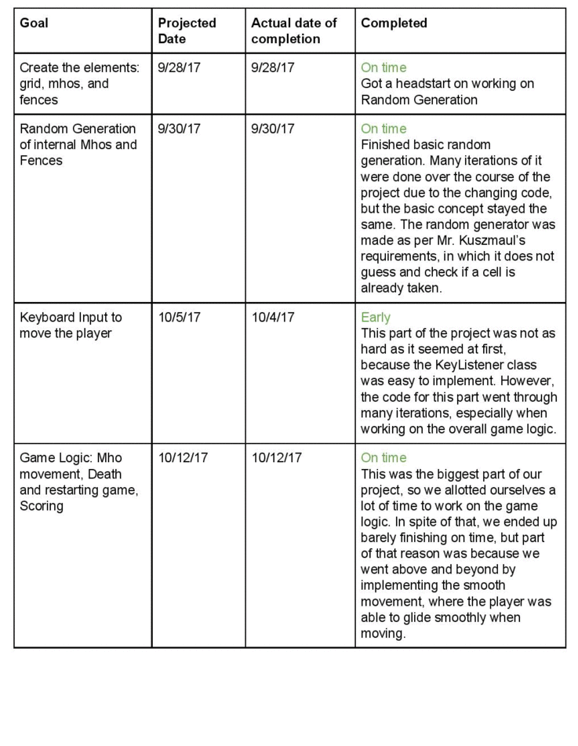

# The Hivolts Project

## Introduction:

The Hivolts project was made by Brion Ye, Caleb Tan, and Julius Kim, and the goal of this project was to recreate the classic Hivolts game, in which a player avoids enemy mhos until all the mhos have run into electric fences.

## Specifications

The game involves several elements:  
**Board** - The board is initialized as a 720x720 square that is painted snow white. There is an imaginary grid system consisting of square cells that are each 60x60. This means that the grid 12 cells by 12 cells.  
**Fences** - There are outer perimeter fences that take up the outer perimeter of the board and prevent the player from exiting the board. There are also inner fences that are generated randomly when the game starts.  When the player(you) collide into the fences your character gets killed from the electric fence.   
**Player** - The player’s goal is to avoid the mhos and fences at all costs, but move in the way that the mhos chasing it end up hitting fences. The player can move up, down, left, right, diagonal right up, diagonal left up, diagonal right down, diagonal left down, or remain in their current position by pressing the “s” key.  
**Mhos** The Mhos goal in this game it to kill the player(you).  They are your enemy. They move in the way that the player moves. This means that ALL the mhos will move to where your new location and to trap and kill you.   
**Scoreboard, and Game Over Screen** - The scoreboard is below the playing board, and shows the creators of the game, as well as how many mhos are left alive. If the player ends up hitting a fence OR a mho catches the player, the game over screen is painted, which gives the player the ability to restart the game.  
**Random Generation** - The random generation is the part of the program which randomly generates the starting places of the internal mhos and fences. I was able to make it so that 

## Errors and Challenges
There were several errors that we encountered. The first major error that happened was that the images were not showing up on some people’s computers. Even though, the paths were correct and relative to the file that it was being referenced to, an IO File not found exception kept getting thrown when trying to run the program. In the end, we made 3 consts in the Element.java class that stored the relative and absolute path sets as string variables, so that we could easily switch between the two paths.   
Another main error we encountered was that the mhos would sometimes be able to occupy the same spot as a fence, and two mhos could be able to occupy the same cell. When debugging this issue, we realized that the issue was that the mho would be 1 or 2 digits off of where it is supposed to be. As of right now, we have not been able to determine why it would be 1 or 2 digits off, so Brion was forced to  implement a quick fix that would round the mho coordinates to the nearest cell's digits. As crude as this fix was, it served its purpose.  

## Overview of Code
The project has multiple methods, classes, and objects. Each part is listed below:   
- **Main.java** - The class contains the main method which initializes the game panel, the jframe to contain the panel, and it packs and adds the panel to the jframe.
- **Game.java** - Game is the jpanel class that displays the game, and it also contains all the game logic. It implements ActionListener and KeyListener. KeyListener has methods that get invoked when a key is pressed, while action listener is invoked when the timer is run. Important properties:
  - Game() constructor - This constructor is for the game method and is run upon intialization, it adds the key listener to the jpanel, and calls the startGame() method.
  - startGame() - It starts the game by clearing the fences and mhos arraylists of all objects, as well as calling the generateElements() method. startGame() is called whenever the game is reset.
  - generateElements() - This method generates every single element on the board. It first loops through the outer perimeter fences and adds each fence object to the fences array. Then, it shuffles the arraylist that contains each possible cell and its cell coordinates. Finally, the first 12 coord sets are given to mhos, the next 20 are given to the inner fences, and last one is given to the starting position of the player
  - isEmpty() - This method can be called whenever needed. It returns one of three numbers to represent if the coords given in the parameter are already taken by a mho, fence, or nothing. 
  - moveMhos() - Used to call the moveTowards() method in the mho class for each mho.
  - roundCoords() - roundCoords() is the hotfix method that Brion wrote which finds the closest cell to where an element is supposed to be. See second paragraph about error. 
  - gameOver() - In this method, there is a call to isEmpty to check if the player's coordinates are conflicting with a mho or fence's coordinates. If so, then the paintEndScreen() method is called to paint the end screen saying game over. However, if all mhos have died, then the paintEndScreen() method is still called but with the parameters to paint Congratulations. Finally, the timer is stopped. If nothing has changed, then the program proceeds normally. It is important to note that this method is called whenever the game is repainted, so there is a constant update.  
  - paintEndScreen() - paints the gameOverScreen based on parameters given to it by the call to it in the gameOver() method. 
  - keyReleased() - It is the method used that comes from the KeyListener implementation. When a key is pressed, this method checks to see if it's a move command, or a key to restart, and then either repaints the whole screen, or makes the key code public for actionPerformed() to use. If it is a move command, the method will also start the timer. 
  - actionPerformed() - This important method is invoked whenever the timer is started, and it is called every 1 millisecond, as specified in the timer object declaration. The purpose of this method is to allow for smooth movement. Essentially, it calls the player.movePlayer 10 times, and player.movePlayer increments the player's location by 6 each time, for a total of 60. It does the same thing afterwards to the mhos as well. Finally, the method stops the timer, resets the counter to 0, checks to see if any mhos have collided, repaints everything, and then calls gameOver() to check if the game is over. 

- **Element.java** - This class serves as the base class for the mho, fence, and player class. It contains the x and y coordinates, since the mhos, fences, and player all have x and y coordinates. The getGridCoord() class method also returns the cells coordinates for generateElements() in Game.java to use. Finally, the move() method takes in the x and y coordinates given to it by the player or mho to change the x and y's accordingly. 
- **Fence.java** - Fence is a child class of ELement and since it's position stays the same through out the whole code, it doesn't have a move function and is simply painted when called. 
- **Mho.java** - This class is to create the mho object. Inside this class, there is the code which repositions the mho based on where the player is and calls the move() method to do so. See the comments. 
- **Player.java** - The final class is the Player.java class. An object of this class is created in Game.java, and is involved with the key and actionListener to change the player's position based on the key presses. In Player.java, the movePlayer method takes in the key code given to it by actionListener, and then changes the x or y position based on the key, which then is given a 6x multiplier in the move method of element, as is the same with Mho. 

## Projected Deadlines vs Actual Completion

The table below shows what my projected deadlines were and when I actually completed each part of my project. 

## Acknowledgements

The project work was split among the 3 members. I (Caleb Tan) was in charge of creating each element and doing some of the game logic, as well as the smooth movement and random generation. This meant working on creating the death function, the restart game function, action listening, and the game over screen as well as the scoreboard. I also created the basic structure of the code. Brion was in charge of working on the rest of the game logic and the mho movement. He created the mho logic, and the algorithms for how the mhos would move in relation to the player, and there were some aspects of game logic that he worked on as well, such as the isEmpty() and roundCoords() function. Julius worked on the key listeners, or more specifically, linking the keyboard input to the player movement. 

I would additionally like to thank Jason's group from Period 4 for giving me the idea of having smooth movement and the scoreboard below the game. :+1: to them.

